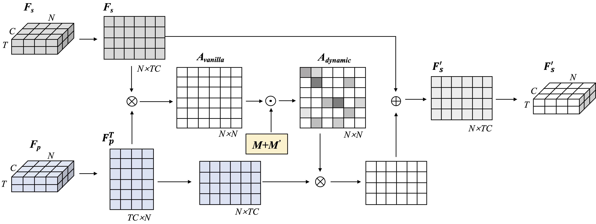

<p align="center">
  
</p>
<p align="center">
  Our proposed PG-GCN model. A pair of skeleton sequence and pose sequence from the same action fragment {Is, Ip } are first pre-processed and then fed into the feature embedding module to obtain the feature representations {Fs, Fp }. Then, the pose-guided attention module (PG-AM) computes the attention summaries that encode the correlations between Fs and Fp . Finally, the skeleton graph representation encoded with pose information will be handed over to the classification module to produce the action classification predictions.
</p>


# Abstract

Graph convolutional networks (GCN), which can model the human body skeletons as spatial and temporal graphs, have shown remarkable potential in skeleton-based action recognition. However, in existing GCN-based methods, the graph-structured representation of the human skeleton makes it difficult to be fused with other modalities, especially in the early stage. This may limit the scalability and performance in action recognition tasks. In addition, the pose information, which naturally contains informative and discriminative clues for action recognition, is rarely explored together with skeleton data in existing methods. In this work, we propose a multi-modal framework named pose-guided GCN (PG-GCN) for high-performance human action recognition. In particular, a multi-stream network is constructed to simultaneously explore the robust feature from both the pose and skeleton data. Moreover, a dynamic attention module is designed for early-stage feature fusion. The core idea of this module is to utilize a trainable graph to aggregate features from the skeleton stream with that of the pose stream, which leads to a more robust feature representation ability of the network. Extensive experiments show that the proposed PGGCN can achieve state-of-the-art performance on the NTU RGB+D 60 and NTU RGB+D 120.

# Overview

<p align="center">
  
</p>
<p align="center">
  Illustration of our pose-guided attention module (PG-AM). The yellow box indicates that the parameter is learnable. ⊗ denotes the matrix multiplication. ⊙ denotes element-wise multiplication. ⊕ denotes the elementwise summation.
</p>

In this paper, we propose a novel multi-model framework with pose-guided GCN (PG-GCN) for skeletonbased action recognition. We novelly introduce the pose information as part of the network input. To fuse the features of the pose stream and skeleton stream, we have proposed a pose-guided attention module for capturing the correlations of joints in the pose feature map and skeleton feature map for guiding the graph feature learning dynamically. The pose-guided attention module helps the network learn the most discriminative features from the skeleton sequence and improves modelling capability. The proposed method achieved competitive performance on two large-scale action recognition datasets. Experimental results proved that our proposed method could effectively leverage the pose information to improve the action recognition accuracy.

# Action Recognition Classification Confusion Matrix
<p align="center">
  
</p>
<p align="center">
  Confusion matrix of (a) our network without using attention and (b) our PG-GCN with dynamic attention on NTU RGB+D 60 dataset in X-Sub benchmark. The X-axis (True class) and Y-axis (Predicted class) are associated through the indices of action classes.
</p>

# Acknowlegements
This work was supported by the Major Project of the Korea Institute of Civil Engineering and Building Technology (KICT) [grant number number 20210397-001].

# Citation
```
@article{chen2022pose,
  title={Pose-Guided Graph Convolutional Networks for Skeleton-Based Action Recognition},
  author={Chen, Han and Jiang, Yifan and Ko, Hanseok},
  journal={arXiv preprint arXiv:2210.06192},
  year={2022}
}
```
